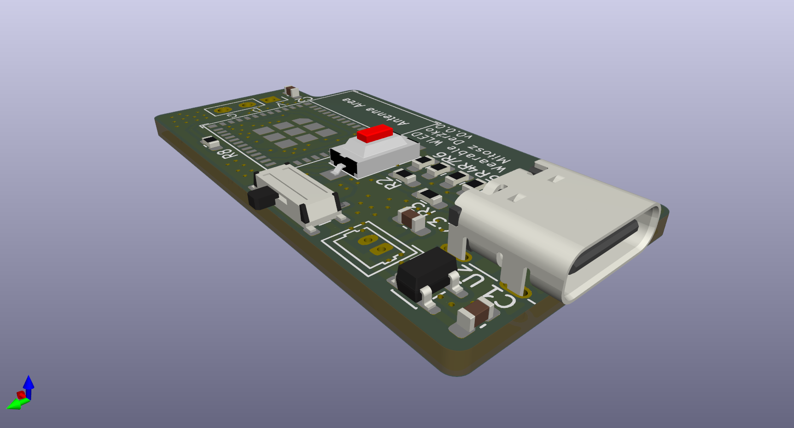
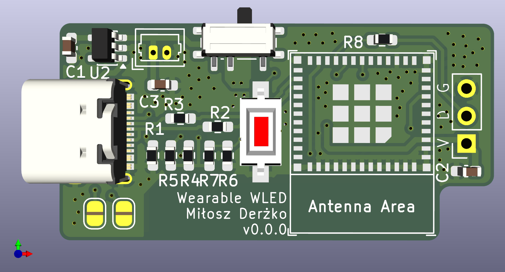

# Wearable WLED Hardware

[← Back to main repository](https://github.com/MiCyg/WearableWLED.git)

---

This PCB combines an ESP32‑C3 Mini with a battery charger, a power switch, and a USB‑C connector for power and programming. All components are low‑cost and readily available. The PCB measures 20×40 mm, allowing a compact enclosure and battery.

	

	
	

